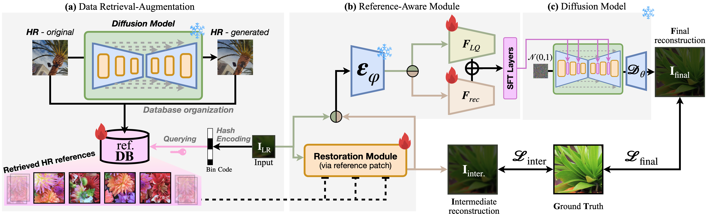

## Reference-based Super-Resolution via Image-based Retrieval-Augmented Generation Diffusion (2025 ICCV)

<p align="center">
  <a href="https://openaccess.thecvf.com/content/ICCV2025/papers/Lee_Reference-based_Super-Resolution_via_Image-based_Retrieval-Augmented_Generation_Diffusion_ICCV_2025_paper.pdf"></a>
  <a href="https://byeonghunlee12.github.io/iRAG_page/"></a>  
  <a href="https://github.com/ByeonghunLee12/iRAG"></a>  
  <br>
</p>


[Byeonghun Lee](https://scholar.google.com/citations?user=0VhcJXwAAAAJ&hl)<sup>1*</sup> | 
[Hyunmin Cho](https://scholar.google.com/citations?user=MRz6g3QAAAAJ&hl)<sup>1*</sup> | 
Hong Gyu Choi<sup>2</sup> | 
Soo Min Kang<sup>2</sup> | 
Iljun Ahn<sup>2</sup> | 
[Kyong Hwan Jin](https://scholar.google.com/citations?user=aLYNnyoAAAAJ&hl)<sup>1†</sup>

<sup>1</sup>Korea University, <sup>2</sup>Independent Researcher  



## Overview

iRAG performs reference-based super-resolution in two stages:

1. **Reference retrieval** (`match/`) — for a low-resolution query, retrieve
   semantically similar high-resolution references from a database with a compact
   contrastive binary hash (VGG16 baseline or a CLIP encoder). The reference
   database is expanded with an SDEdit-based hallucination augmentation.
2. **Diffusion super-resolution** (`sr/`) — a latent-diffusion SR model trained
   end-to-end with a TTSR restoration branch that conditions on the retrieved
   reference to reconstruct the high-resolution image.

```
iRAG/
├── match/                 # stage 1: reference retrieval + data augmentation
│   ├── main.py            #   train / evaluate the hash encoder
│   ├── model/ loss/ utils/
│   └── SR_Utils/          #   SDEdit augmentation + pair construction
└── sr/                    # stage 2: reference-based diffusion super-resolution
    ├── train.py           #   training
    ├── inference.py       #   reference-based SR sampling
    ├── eval.py            #   metrics (PSNR/SSIM/LPIPS/CLIP-IQA/MUSIQ + color fix)
    └── configs/irag.yaml  ldm/  basicsr/  scripts/
```

## Environment
* python 3.8
* CUDA 11.8

```
conda env create -f environment.yml
pip install -r sr/requirements.txt
```

## Dataset
Download [DIV2K](https://data.vision.ee.ethz.ch/cvl/DIV2K/), [Flickr2K](https://cv.snu.ac.kr/research/EDSR/Flickr2K.tar), [CUFED5](https://drive.google.com/drive/folders/13BGwJMQfK6xhCNXN0y53dctthVloxniz), and [OST dataset](https://github.com/xinntao/SFTGAN).

---

## Stage 1 — Reference retrieval (`match/`)

### Data augmentation (SDEdit hallucination)
Expand the reference database by hallucinating realistic variants of each image.
```
python match/SR_Utils/SDEdit_Hallucination/generate_data.py \
  --img_path <INPUT_IMG> \
  --prompt "<PROMPT_TEXT>" \
  --strength_base <0-1> --strength_span <0-1> \
  --guidance_base <VAL> --guidance_span <VAL> \
  --iterations <N> --num_samples <M> \
  --model_name <HF_MODEL_ID> \
  --device <cuda|cpu> --gpu <GPU_ID> \
  --out_folder <LOW_DIR> --out_folder_high <HIGH_DIR>
```

### Train / retrieve
```
cd match
python main.py \
  --query_path <QUERY_DIR> \
  --database_path <DB_DIR> \
  --encode_length <BITS> \
  --batch_size <N> \
  --epochs <E> \
  --lr <LR> \
  --num_runs <RUNS> \
  --validate_frequency <VAL_FREQ> \
  --num_workers <WORKERS> \
  --seed <SEED> \
  --device <GPU_ID> \
  [--train] \
  [--use_clip] \
  [--num_bad_epochs <M>] \
  [--ckpt_path <CKPT_FILE>]
```

---

## Stage 2 — Diffusion super-resolution (`sr/`)

All commands below are run from `sr/`. Each data root holds paired `gt/`, `sr_bicubic/`, `lr/` and `ref/`
subfolders sharing the same basenames.

### Training
```
cd sr
python train.py --train \
  --base configs/irag.yaml \
  --gpus 0, --name irag --scale_lr False
```

### Evaluation
```
cd sr
python eval.py \
  --config  configs/irag.yaml \
  --ckpt    path/to/iRAG.ckpt \
  --val-dir PATH/TO/valset \
  --ddim-steps 50 --colorfix all
```
A wavelet or AdaIN color fix (using the bicubic LQ as the color reference) can be
applied to the SR output before scoring; `--colorfix all` reports
none/adain/wavelet together in a single diffusion pass.

## Download the pretrained models
Download the pretrained models from [pretrained](https://drive.google.com/drive/folders/1-onBC231a5EFVmstBzLx8hYkrN0s1qvJ?usp=sharing).

## Citations

```
@InProceedings{lee2025irag,
    author    = {Lee, Byeonghun and Cho, Hyunmin and Choi, Hong Gyu and Kang, Soo Min and Ahn, Iljun and Jin, Kyong Hwan},
    title     = {Reference-based Super-Resolution via Image-based Retrieval-Augmented Generation Diffusion},
    booktitle = {Proceedings of the IEEE/CVF International Conference on Computer Vision (ICCV)},
    month     = {October},
    year      = {2025},
    pages     = {10764-10774}
}
```

## License
This project and related weights are released under the [Apache 2.0 license](LICENSE).
